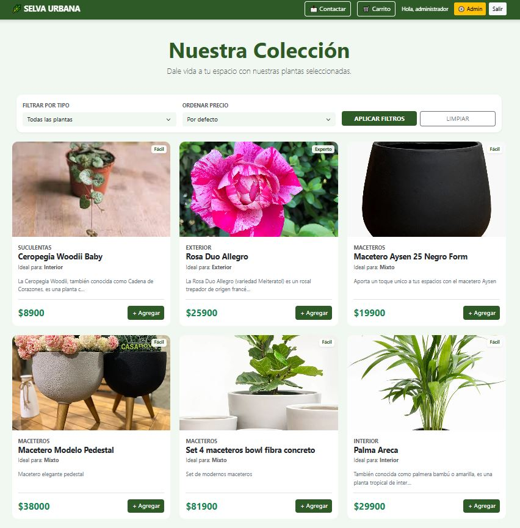
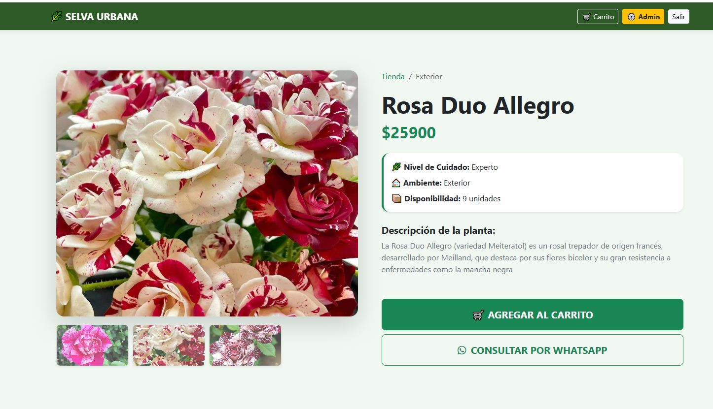
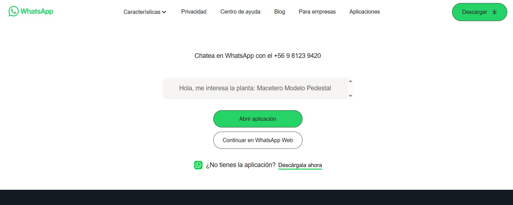
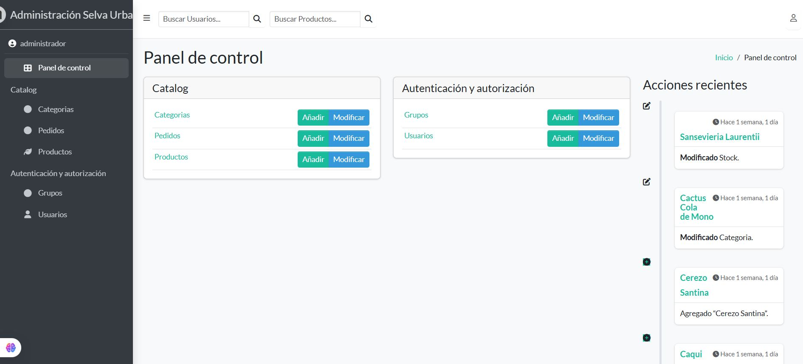

# 🌿 Selva Urbana - E-commerce de Plantas & Decoración

**Selva Urbana** es una plataforma web profesional desarrollada con **Django**, diseñada para la comercialización de plantas de interior y accesorios de decoración. El proyecto destaca por su enfoque "Mobile First", un diseño limpio y una experiencia de usuario fluida.

---

## 🚀 Funcionalidades Principales

* **Catálogo Dinámico:** Filtrado por categorías y ordenamiento por precio.
* **Gestión de Stock:** Visualización de productos agotados y etiquetas de nivel de cuidado.
* **Carrito de Compras:** Sistema persistente basado en sesiones para gestionar pedidos.
* **Integración con WhatsApp:** Botón de consulta directa que envía automáticamente el nombre del producto interesado.
* **Panel Administrativo Premium:** Gestión completa de inventario mediante una interfaz moderna (Jazzmin).
* **Galería Interactiva:** Visualización detallada de productos con cambio de imágenes dinámico.

---

## 📸 Capturas de Pantalla

### 🏠 Home (Catálogo)
Interfaz principal con diseño de tarjetas, insignias de stock y filtros rápidos.


### 🔍 Detalle del Producto
Vista enfocada en el producto con galería de imágenes y botones de acción claros.


### 📲 Conexión por WhatsApp
Integración directa para cerrar ventas de forma personalizada.


### ⚙️ Panel de Administración (Django Jazzmin)
Backend optimizado para una gestión ágil del catálogo y usuarios.


---

## 🛠️ Tecnologías Utilizadas

* **Backend:** Python 3.x & Django 5.x
* **Base de Datos:** PostgreSQL
* **Frontend:** HTML5, CSS3 (Custom Properties), Bootstrap 5 & FontAwesome
* **Panel Admin:** Django Jazzmin
* **Despliegue sugerido:** Render / GitHub

---

## 🔧 Instalación Local

1. Clona el repositorio:
   ```bash
   git clone [https://github.com/tu-usuario/selva-urbana.git](https://github.com/tu-usuario/selva-urbana.git)